# Operanto — User Manual

> **Where conversations become operations.**
> A day-to-day guide to running Operanto: turning customer messages into
> qualified opportunities, requirements, quotes, approvals, appointments and
> CRM records — plus the supporting inbox, tasks, SOPs, content and analytics.

Version 0.2 · Last updated 2026-06-26

For setup/admin topics (install, env, roles, channels) see
[ADMIN_MANUAL.md](ADMIN_MANUAL.md). For product rationale see
[BLUEPRINT.md](BLUEPRINT.md). The operational layer is specified in
[WORKFLOW_ENGINE.md](WORKFLOW_ENGINE.md).

> **About the screenshots.** Images are captured from the seeded demo
> workspaces — **Bloom Studio** (a beauty salon) for the communication modules
> and **Lumea Goods** (boutique ecommerce) for the operational spine. Your data
> and branding will differ. Screenshots are regenerated with
> `pnpm tsx scripts/capture-screenshots.ts` (see [§16](#16-regenerating-the-screenshots)).

---

## 1. Core idea

Operanto treats every customer message as a **latent operation** — a lead, a
quote, an appointment, a missing document. The job of the product is not just to
store and route messages, but to interpret what a conversation *means*
commercially and move it toward completion:

```
conversation → opportunity → requirements → quote → approval → appointment → CRM
```

The **Opportunity** is the spine: a `Conversation` stays the communication
record, while an `Opportunity` is the commercial object that gathers
requirements, a workflow, quotes, appointments, approvals and documents, then
pushes the result to your CRM/ERP.

Two principles hold everywhere:

- **A human always approves before anything goes to a customer.** Operanto never
  auto-sends customer replies, and sending a quote can require manager approval.
- **Verticals are configuration, not code.** The same engine runs a beauty
  salon, a jewellery shop or a windows installer — the difference is the
  catalogue, business rules and requirement schema, not a forked product.

---

## 2. Getting started

### Logging in

1. Go to the app URL (e.g. `http://localhost:3000`).
2. Sign in with your email and password (set by your admin — there is no
   self-service signup).
3. If you belong to more than one workspace, pick one on the **Select workspace**
   screen. The workspace switcher at the top lets you change later.

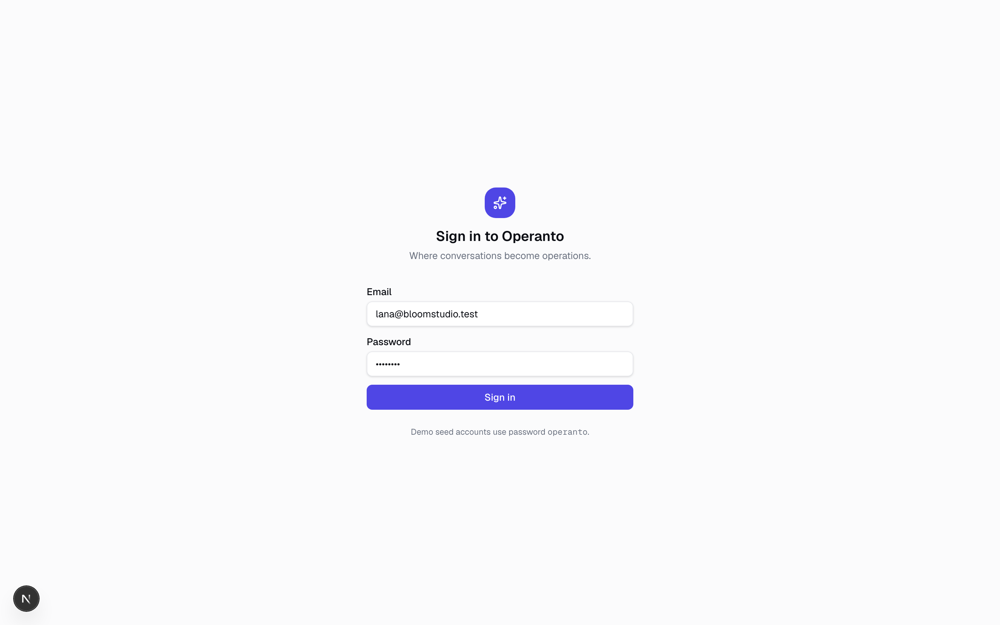

> Demo seed accounts use password `operanto` — e.g. `lana@bloomstudio.test`
> (owner) or `elira@lumeagoods.test` (owner). See
> [ADMIN_MANUAL.md §8](ADMIN_MANUAL.md#8-demo--seed-data).


### What you can see depends on your role

The left sidebar only shows modules your role can use. The server enforces every
action regardless of what the UI shows.

| Role | Day-to-day focus | Spine powers |
|---|---|---|
| **Owner / Admin** | Everything, incl. settings, members, channels. | All — including approve/reject and CRM pushes. |
| **Manager** | Inbox, opportunities, quotes, scheduling, content, QA, reports, automations, channels, catalogue. | **Decides approvals**, pushes to CRM, edits the catalogue. |
| **Agent** | Inbox, opportunities, quotes, appointments, tasks, content. | Runs the full opportunity → quote → appointment flow, but **can't** approve a send, push to CRM, or edit the catalogue. |
| **Reviewer** | Read conversations, QA review, reports. | — |
| **Client viewer** | Reports only. | — |

Full breakdown in [ADMIN_MANUAL.md §6](ADMIN_MANUAL.md#6-identity-roles--permissions).

---

## 3. The layout

- **Left sidebar** — module navigation: Command, Inbox, Opportunities,
  Approvals, Tasks, SOPs, Studio, Intelligence, Automations, Team, Settings
  (filtered by role).
- **Top bar** — workspace switcher and global search (conversations, tasks, SOPs).
- **Center** — the active module.
- **Right panel** — context (in the Inbox: AI summary, customer, MediaSync
  handling/consent, tags, notes).
- **Command bar** (bottom) — *"Ask Operanto to do something…"* with suggested
  prompts.

---

## 4. Command center

Your home screen — "What needs your attention." It shows:

- **Stat cards** — open conversations, leads detected, open tasks, overdue tasks.
- **Priority conversations** — the most urgent open threads; click to open.
- **Insights** — AI-surfaced opportunities (e.g. "18 leads not followed up within
  24h", "Pricing is your #1 inbound question"). A `content_opportunity` insight
  offers a **Create post** shortcut into Studio.
- **Open tasks** — your team's next tasks by due date (overdue flagged red).

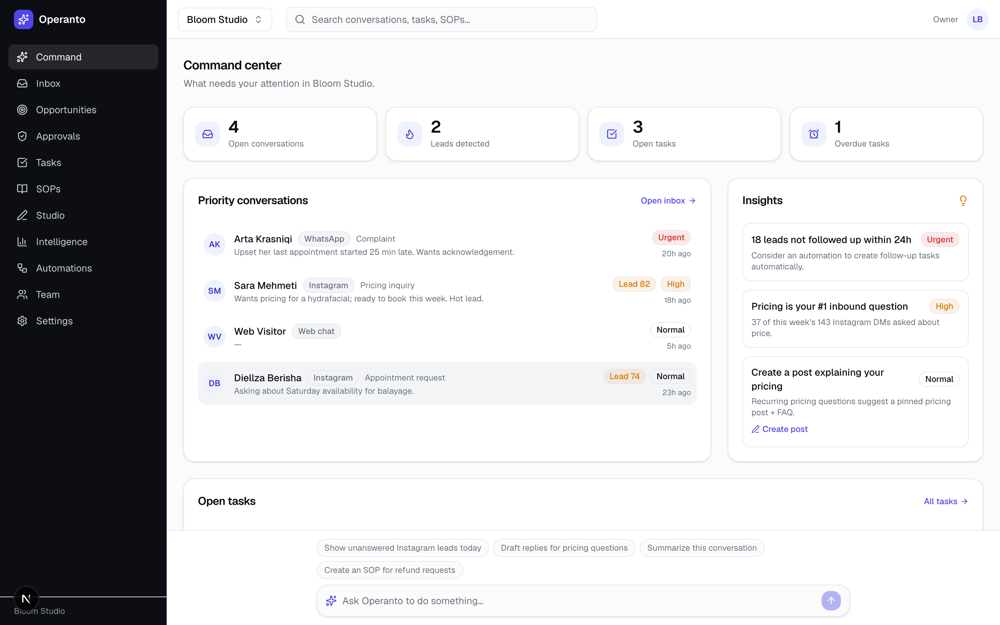

---

## 5. Inbox

The unified conversation center — every channel (WhatsApp, Instagram, Facebook,
email, SMS, Viber, web chat) in one list.

### Finding conversations

Filter by **status** (open, pending, waiting, resolved, archived), **channel**,
**assignee** (e.g. *me*), and free-text **search**.

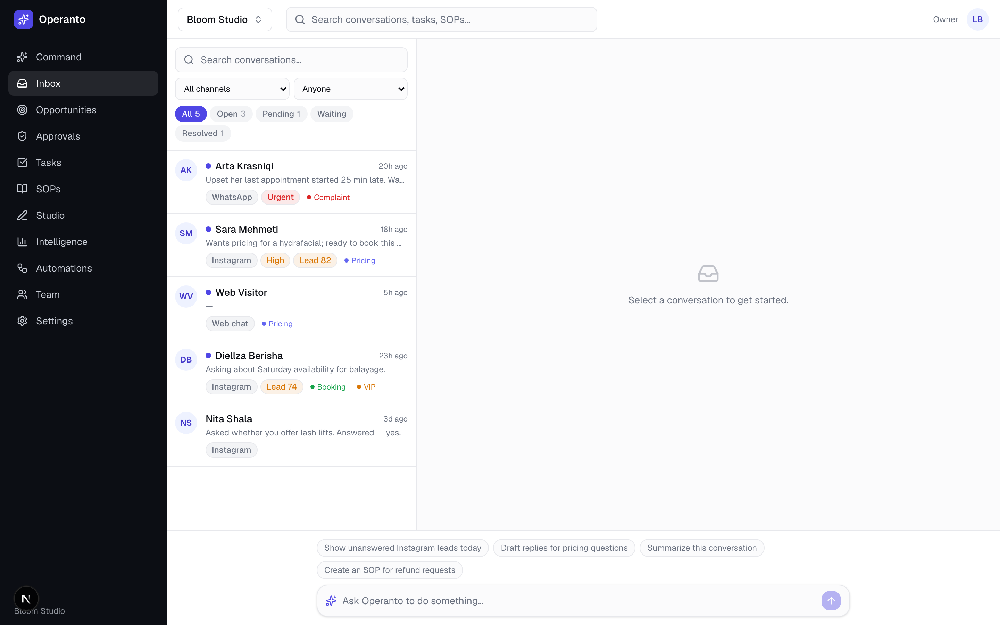

### Working a conversation

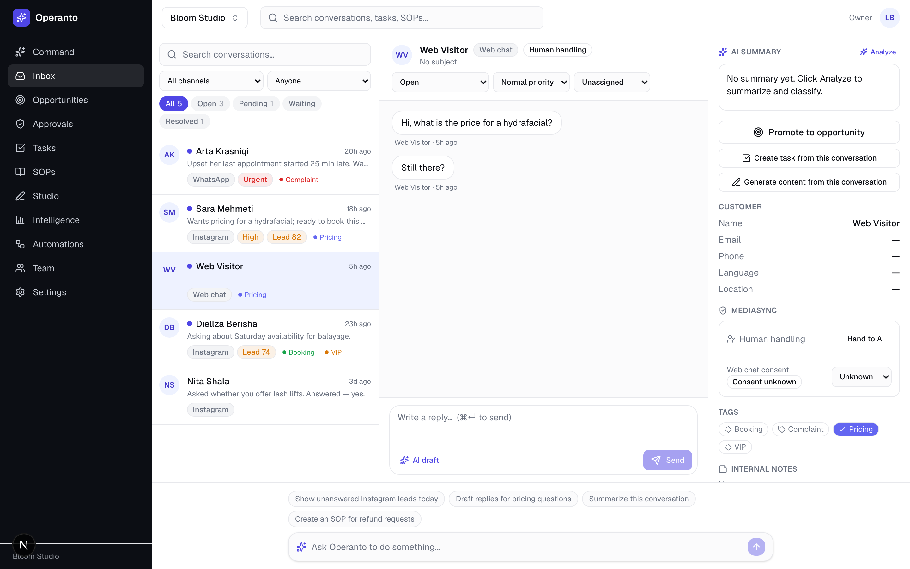

Open a thread to see the message history (inbound, your outbound replies, and
internal notes are visually distinct). From here you can:

- **Triage** — change **status**, set **priority**, and **assign** a teammate.
- **Reply** — type in the composer and send. Outbound goes **only** when you
  send it; sending puts a human in control of the thread.
- **Tag** and leave **internal notes** (customers never see notes).

The **right-hand AI panel**:

- **Analyze** — AI summarizes and classifies the thread: **intent** (e.g.
  *Pricing inquiry*), **sentiment**, and a **lead score** (0–100; ≥70 is flagged
  a lead).
- **Promote to opportunity** — turn this conversation into a commercial
  Opportunity (the start of the spine — see [§6](#6-opportunities--the-commercial-spine)).
- **Create task** / **Generate content** — spin off a follow-up or a Studio draft.
- **Customer** + **MediaSync** — identity, channel consent, and human/AI handling.

> **AI drafts are always editable and never auto-sent.** Review, edit, send.

---

## 6. Opportunities — the commercial spine

An **Opportunity** is the deal behind a conversation. Create one with **Promote
to opportunity** in the Inbox AI panel, or directly here. The list groups them
by status (Open / Won / Lost / Abandoned) and shows requirement progress, owner
and value at a glance.

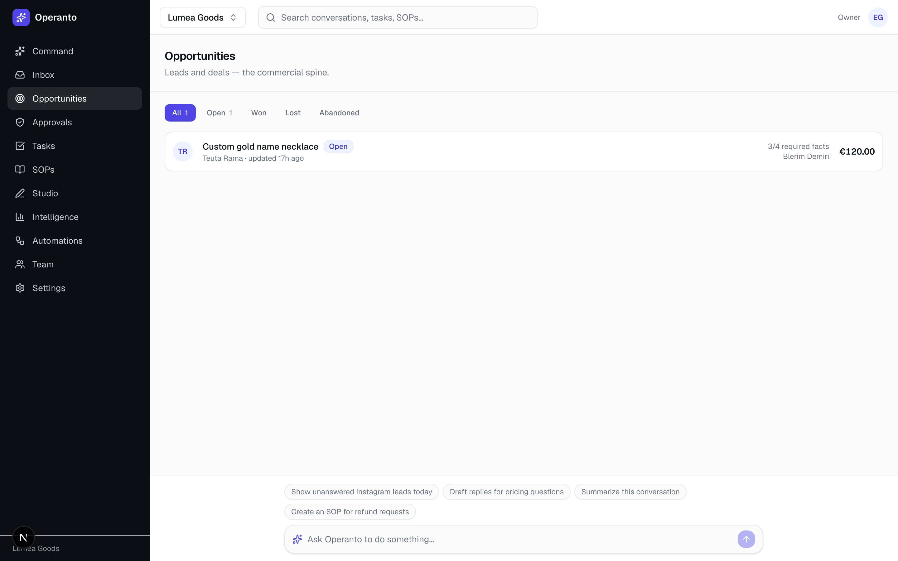

Open an opportunity for the full workspace — requirements, quotes, appointments,
documents on the left; workflow, integrations and customer on the right:

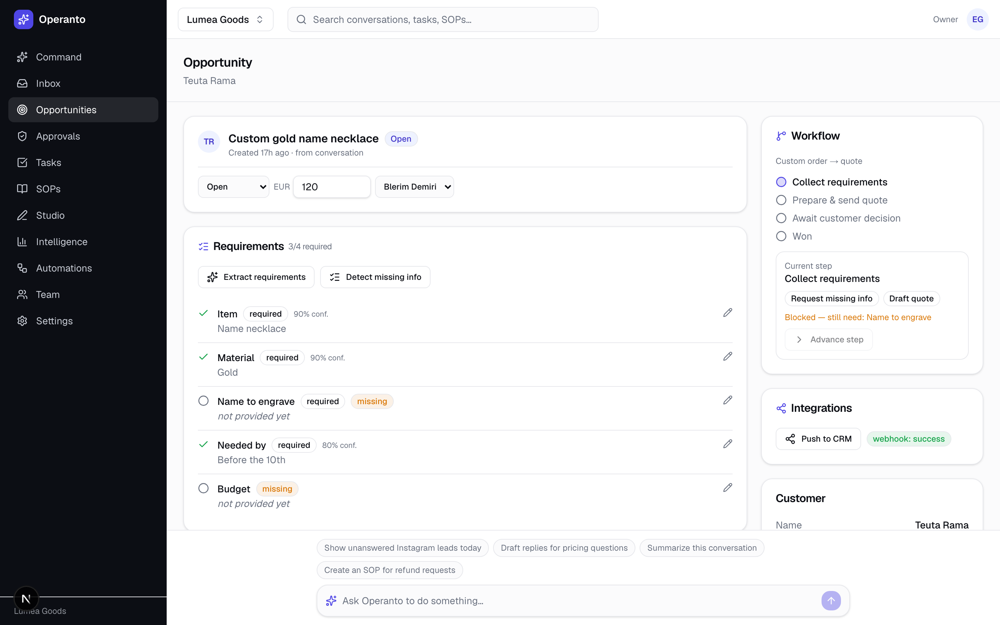

### Requirements (qualification)

Every deal needs a known set of facts before it can be quoted. The
**Requirements** card tracks them with status (✓ provided / ○ missing), a
confidence score from AI, and an inline edit.

- **Extract requirements** — AI reads the conversation and fills in what it can
  (e.g. *Item = Name necklace*, *Material = Gold*), flagging gaps.
- **Detect missing info** — AI lists what's still required and **drafts the next
  question** to the customer. The draft is never sent automatically — review and
  send it from the Inbox.

The header shows progress (e.g. *3/4 required*); the deal is "qualified" once all
required facts are provided.

### Workflow

The **Workflow** card runs the opportunity through its defined stages (e.g.
*Collect requirements → Prepare & send quote → Await decision → Won*). It shows
the current step, the actions allowed there, and **blocks advancement** when a
required fact is missing (e.g. *"Blocked — still need: Name to engrave"*). Click
**Advance step** once unblocked.

---

## 7. Quotes

From an opportunity, **draft a quote** (the Quotes card) — AI builds line items
from your **catalogue** and the opportunity's requirements, then applies your
**business rules** (minimum order, discounts, surcharges) and computes tax.

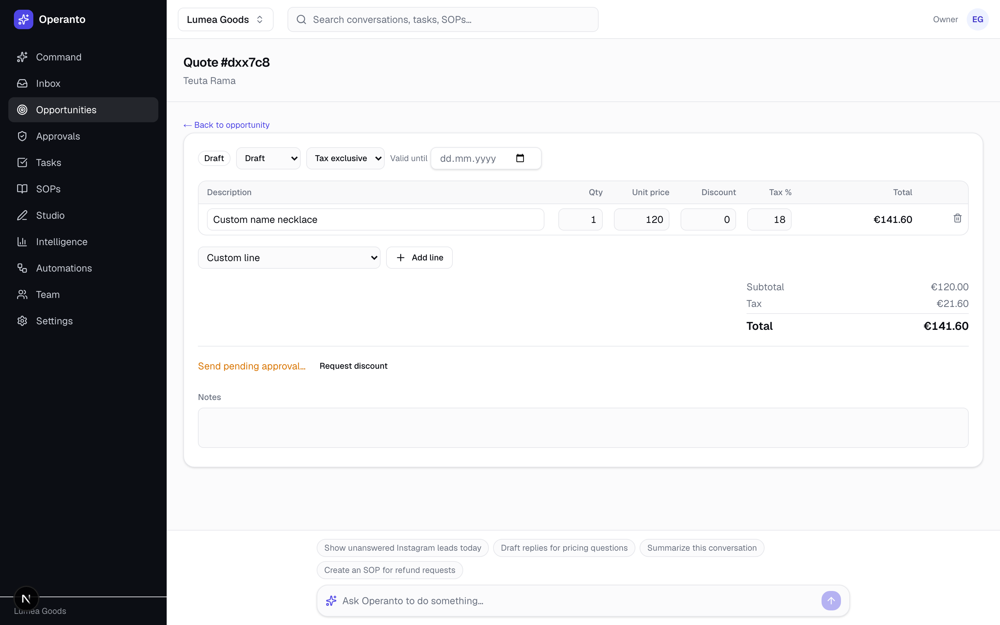

On the quote you can add/edit/remove **lines** (quantity, unit price, discount,
tax %), pick a **tax mode** (inclusive/exclusive), set **valid-until**, and add
**notes**. Totals recompute live.

- **Send** the quote to the customer. Managers and above send directly; an agent's
  send is **gated** and files an approval first (see [§8](#8-approvals)).
- **Request discount** — a price override beyond your authority also routes
  through approval, adding the discount line only once approved.

---

## 8. Approvals

A generic human-approval **gate**. Sensitive actions — sending a quote, a price
override — file an approval request instead of acting immediately. Anyone with
**approvals:decide** (manager and above) sees the queue and can **Approve** or
**Reject**; approval applies the side effect (the quote is sent, the discount is
added). Agents can file requests and track their own.

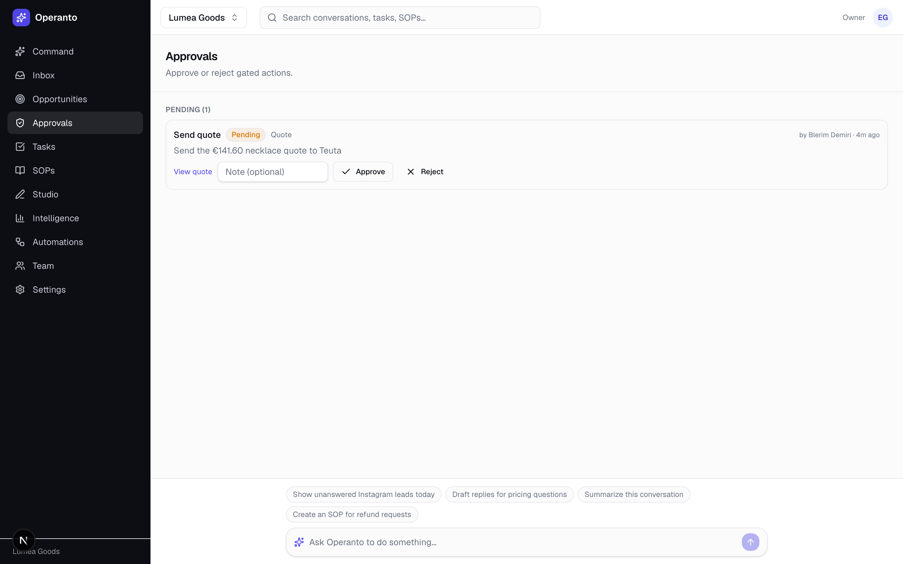

Each request shows the action, the entity, the reason, who filed it, and a
**View** link to inspect before deciding. Cross-workspace decisions are rejected.

---

## 9. Appointments

Schedule **survey/measurement**, **consultation**, **installation**, **support**
or **delivery** appointments against an opportunity. Each can carry a time,
duration, location and assignee, and **exports as an ICS** calendar invite (the
download icon).

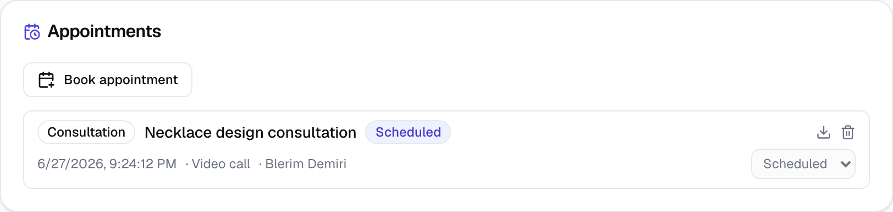

> For windows/home-improvement deals, the **survey** type is the on-site
> *Aufmaß* (measurement) appointment that precedes the final quotation.

---

## 10. Documents

Upload customer **photos, PDFs, plans or forms** to an opportunity. Operanto runs
**extraction** and, where it can, **auto-fills requirements** from the result
(e.g. a brief that yields *material: Gold 18k*, *personalization_text: TEUTA*).
Files are downloadable; extraction fields show as chips with a status badge.

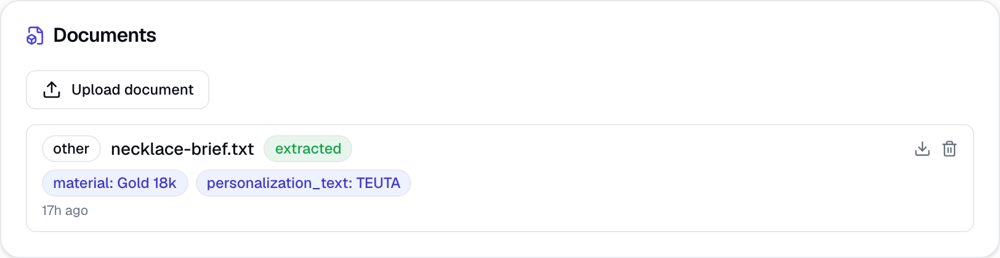

---

## 11. Integrations (CRM / ERP)

Push an opportunity's **contact + deal** to your CRM from the **Integrations**
card (manager and above). Pushes are **idempotent** (one action per opportunity,
safe to retry) and **audited**.

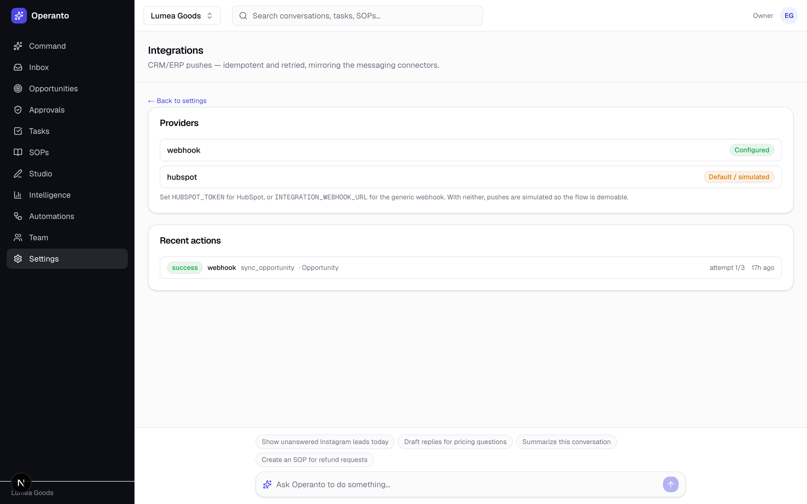

Provider selection is automatic: set `HUBSPOT_TOKEN` for HubSpot or
`INTEGRATION_WEBHOOK_URL` for a generic webhook. **With neither configured,
pushes are simulated** so the flow stays demoable — recent actions still show
success/attempt counts. Settings → Integrations lists provider status and the
recent action log.

---

## 12. Catalogue & business rules

Your vertical's **offering and pricing policy** (Settings → Catalogue; manager
and above). This is where "verticals are configuration" lives.

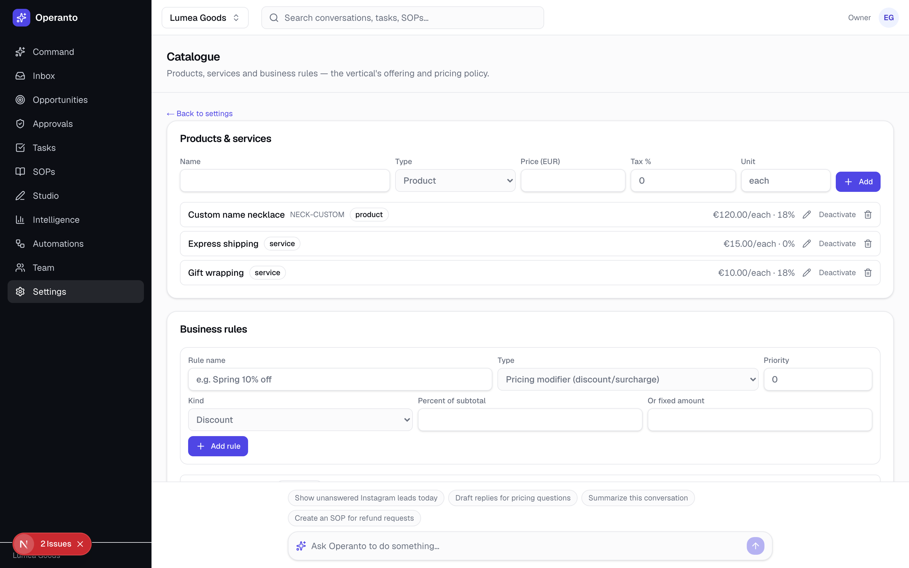

- **Products & services** — name, type, SKU, price, tax %, unit. These feed quote
  drafting and line matching.
- **Business rules** — e.g. *Minimum order €50*, *Returning customer 5%*. Rules
  carry a type, priority, and a discount/surcharge definition; enabled rules are
  applied automatically during quote drafting.

---

## 13. Tasks

A Kanban board — **To do · In progress · Blocked · Done**.

- **New task** with title, description, **priority**, **due date**, **assignee**.
- **From a conversation** — *Create task* in the Inbox AI panel links it to that
  thread and customer.
- Filter by assignee; move cards between columns to change status; overdue dates
  are highlighted.

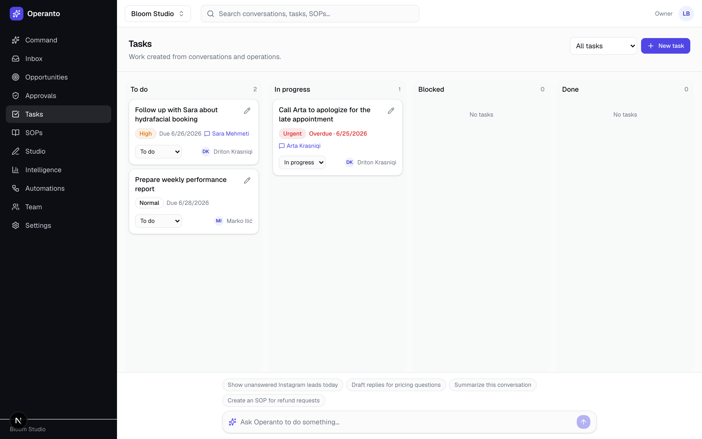

---

## 14. SOPs (Standard Operating Procedures)

Your team's playbook library. Each SOP has a **status** (draft → approved →
archived), a **category**, and a **version**.

- **New SOP** manually, or **Generate with AI** from a situation description.
- **Approve** — owners/admins approve a draft (managers can create but not
  approve). Approved SOPs feed the AI's context so replies stay on-policy.

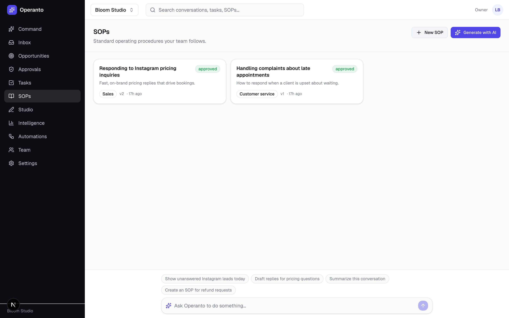

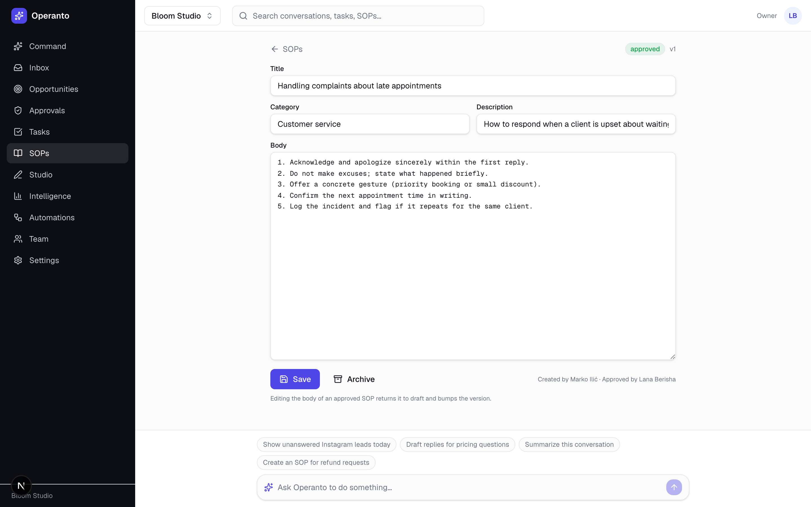

---

## 15. Studio, Intelligence, Automations, Team & Settings

### Studio (content)

Turn conversations and insights into on-brand content across a board (**Ideas →
Drafts → Review → Approved → Published**). Define a **brand voice** (tone,
language, do's/don'ts); generate from a conversation, an insight, or manually.
Each draft records its channel, brand voice and source.

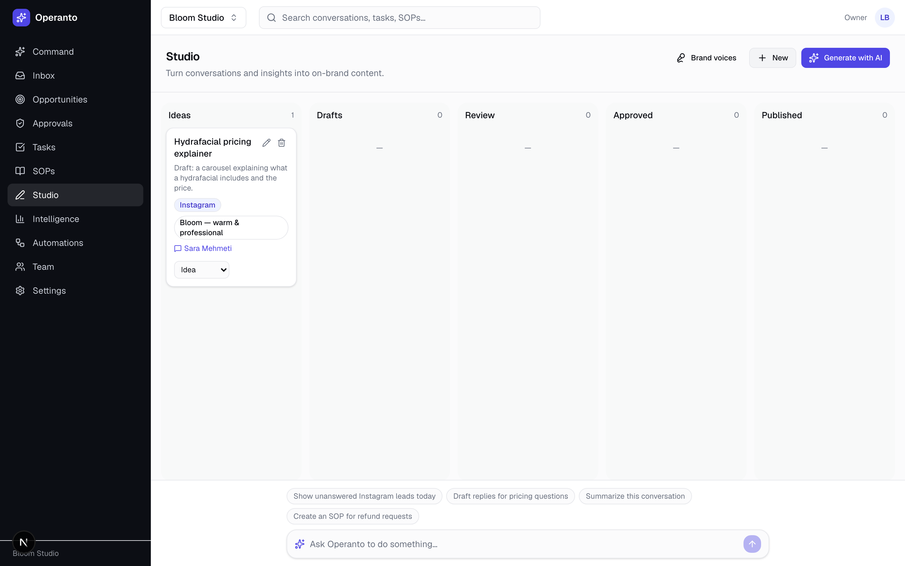

### Intelligence (analytics)

Your operational dashboard: open/resolved conversations, leads detected, average
first response time, overdue tasks, **top intents**, **sentiment mix**,
**message-volume trend**, and **agent workload**. **Generate insights** surfaces
patterns and opportunities (some sendable straight to Studio).

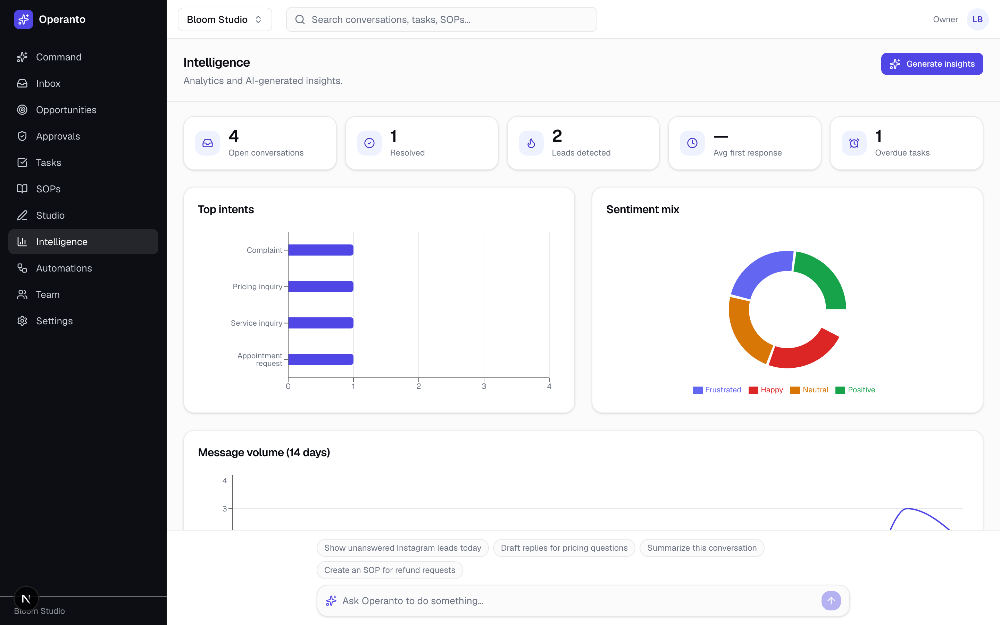

### Automations

Trigger-and-action rules (managers and above): **trigger** (analyzed / new
inbound / conversation created) + optional **conditions** (intent, sentiment,
channel, lead score, message contains) + **actions** (tag, set priority, assign,
create task). Toggle each rule on/off; the card shows when it last ran.

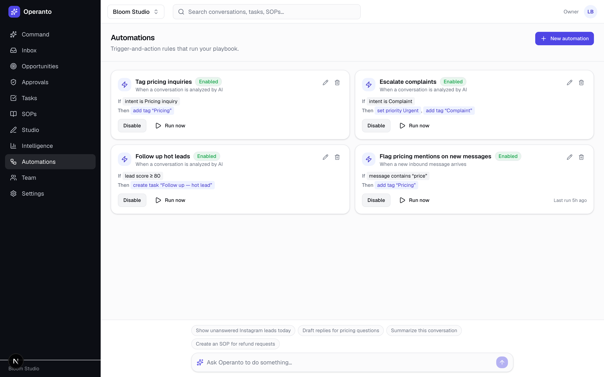

### Team & Settings

**Team** is a read-only view of members, roles and status (changes are made by an
admin). **Settings** holds workspace details and channels, plus the spine config
(Catalogue, Integrations), **Templates**, and **Diagnostics**.

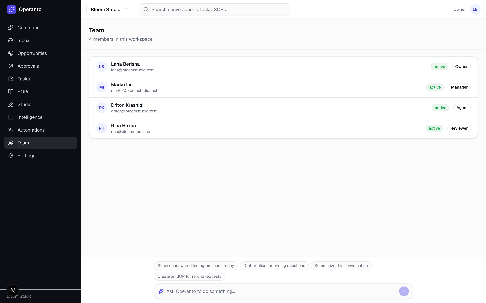

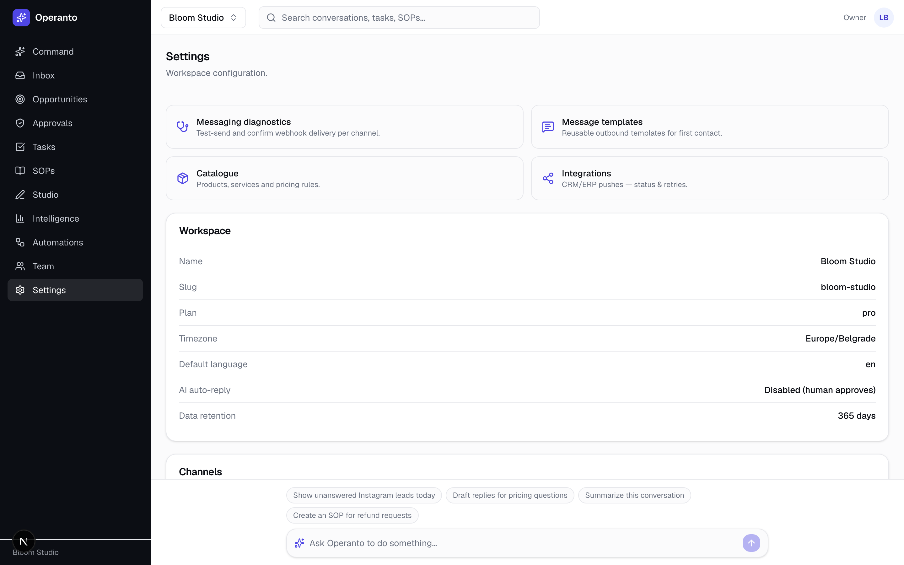

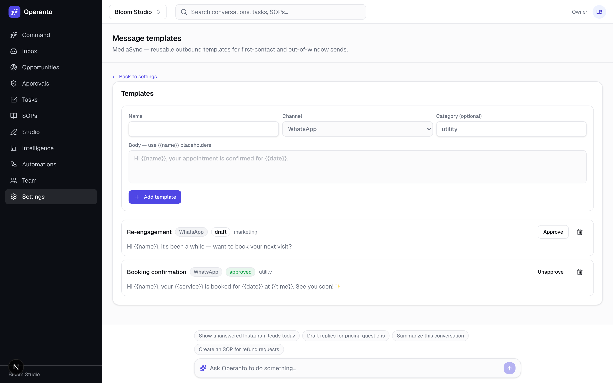

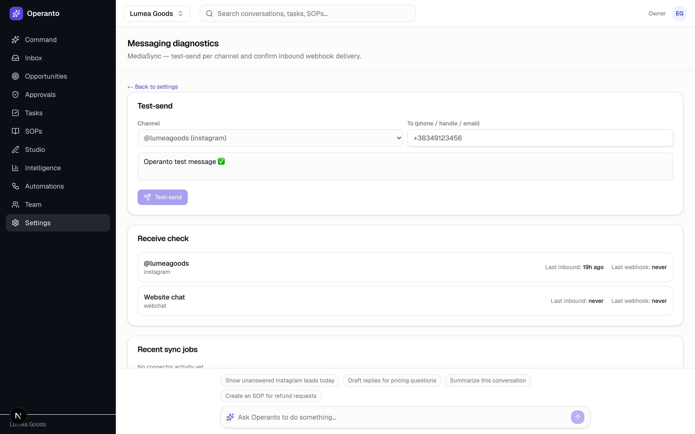

---

## 16. The end-to-end loop (worked example)

The flow Operanto is built to complete — *conversation → CRM* — using the seeded
"custom necklace" deal:

1. A customer message arrives in the **Inbox**; the customer is created/updated.
   
2. Click **Promote to opportunity** → the deal enters the spine.
   
3. **Extract requirements** → AI fills known facts and flags what's missing.
4. **Detect missing info** → AI drafts the next question; you review and **send**
   it from the Inbox (never auto-sent).
5. The customer replies; you mark the missing facts provided → the deal qualifies
   and the **workflow** unblocks.
6. **Draft a quote** from the catalogue; rules and tax apply automatically.
   
7. An agent's **send** files an **approval**; a manager approves it and the quote
   goes out.
   
8. **Book a survey/consultation appointment** (exportable as ICS).
9. **Push to CRM** → contact + deal sync (idempotent, audited).
10. Every step — promote, extract, quote, approval, appointment, integration — is
    written to the **audit log**. Nothing reaches a customer without a human.

---

## 17. Regenerating the screenshots

All images in this manual are produced by a committed script, so they can be kept
current as the UI evolves:

```bash
pnpm dev                               # app on :3000 (postgres up + DB seeded)
pnpm tsx scripts/capture-screenshots.ts  # writes docs/images/*.png
```

The script logs in as seeded demo users, stages a pending approval, and captures
each screen (full-page) plus the Appointments/Documents cards. Override the URL
with `CAPTURE_BASE_URL`.

---

## 18. Tips & FAQ

- **Why can't I see a module?** Your role doesn't grant it ([§2](#2-getting-started)).
- **Did my reply get sent automatically?** No — outbound only sends when you send
  it. AI never messages customers on its own.
- **Why is my quote "send" waiting?** You're an agent; sends are gated and need a
  manager's approval ([§8](#8-approvals)).
- **My CRM deal has no amount / says "simulated".** Configure `HUBSPOT_TOKEN` or
  `INTEGRATION_WEBHOOK_URL`; without them pushes are simulated for demos
  ([§11](#11-integrations-crm--erp)).
- **Is my work isolated from other workspaces?** Yes — you only ever see data for
  the workspace you're in.
- **Where do AI suggestions come from?** Your brand voice, approved SOPs,
  catalogue and conversation context — the AI is told not to invent policy and to
  flag low confidence.

---

## 19. Reference

- Setup & administration: [ADMIN_MANUAL.md](ADMIN_MANUAL.md)
- Operational/workflow layer: [WORKFLOW_ENGINE.md](WORKFLOW_ENGINE.md)
- Product & technical blueprint: [BLUEPRINT.md](BLUEPRINT.md)
