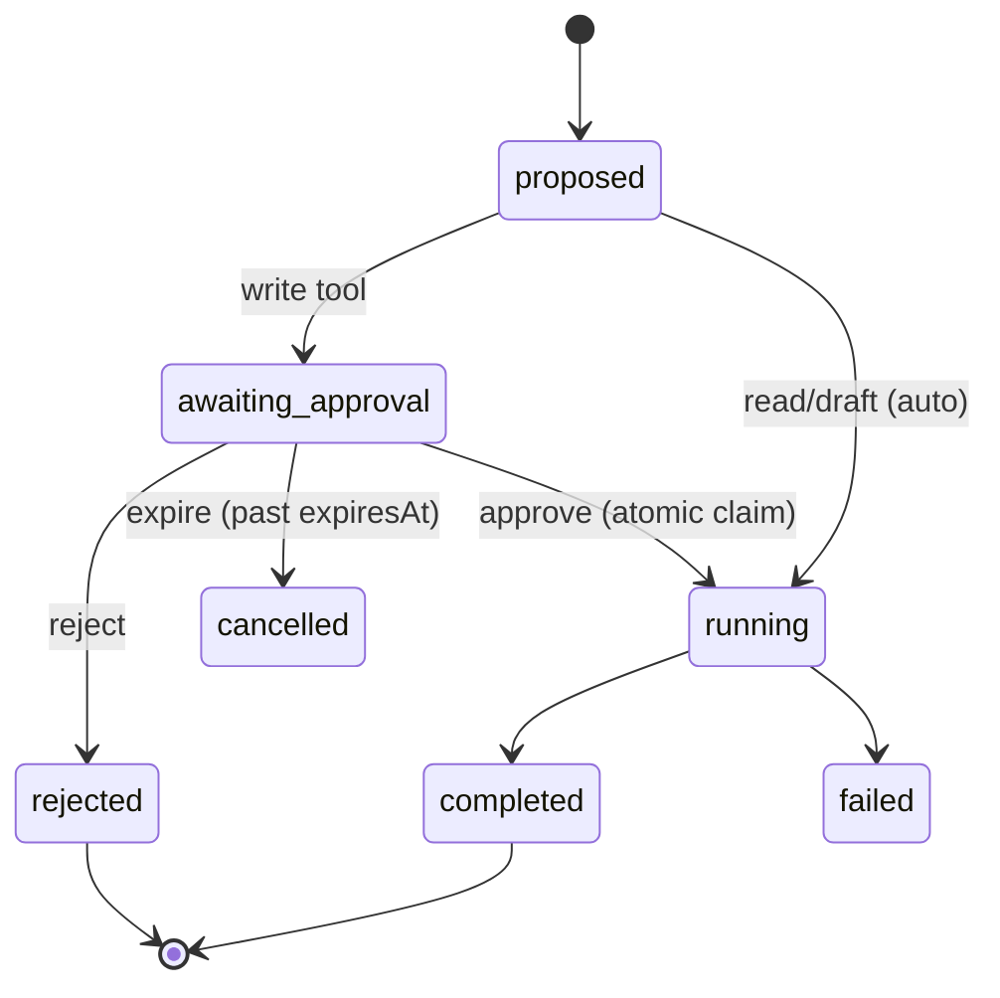

# Approval workflows

Sensitive actions are **prepared, never auto-performed**. The assistant proposes;
a permitted human approves; the runtime executes exactly once. The language is
unambiguous:

- **Prepared but not sent** — a draft (`draft_customer_reply`, `request_viewing`, `draft_social_post`).
- **Awaiting approval** — a `write` tool queued as a `pending` `ApprovalRequest`.
- **Published / Sent successfully** — only after a tool result confirms it.
- **Failed and no external action occurred** — on any execution/connector error.

## Risk tiers → policy

| Tier | Examples | Behaviour |
|---|---|---|
| `read` | search, availability, history, analytics | auto-run for permitted users |
| `draft` | reply/translation/social/viewing invitation | generated automatically, **never sent** |
| `write` | send message, publish post, book viewing, change stage, assign | **approval required** |

Resolution lives in `src/lib/tools/policy.ts`:

- `approval: "always"` → always requires approval.
- `approval: "policy"` → requires approval **unless** the workspace opted in via
  the `OPERANTO_AUTO_APPROVE` allowlist (`workspaceSlug:toolName` or
  `*:toolName`). Default is deny — automation is a deliberate operator action,
  not a default, and there is intentionally no UI to enable it.

## Lifecycle

`ApprovalRequest.status`: `pending → approved | rejected | expired`.

## Decisions (`src/lib/tools/runtime.ts`)

- `approveInvocation(ctx, invocationId, {reviewNote})` — verifies the reviewer
  has **both** `approvals:review` **and** the tool's own permission, atomically
  claims `awaiting_approval → running`, executes once, records the result. A
  second approval finds the row `completed` and returns the prior result (no
  re-run).
- `rejectInvocation(ctx, invocationId, {reviewNote})` — marks `rejected`; the
  tool never runs.
- `updateInvocationInput(ctx, invocationId, patch)` — an approver can **edit** a
  proposed action (e.g. tweak a reply body) before approving; the edit is
  re-validated against the tool schema and audited (`approval.edited`).

Guarantees (all unit-tested in `src/lib/tools/runtime.test.ts`):

- Reject → **no execution**; a later approve is refused.
- Duplicate approval → **exactly one** execution.
- Cross-workspace approval → **not found** (isolation).
- Missing `approvals:review` → `ForbiddenError`.
- Connector/execution failure → `failed`, surfaced honestly (no false success).

## Surfaces

- **Cockpit cards** — an approval renders inline as an `ApprovalCard`
  (Approve / Edit / Reject) in the assistant thread.
- **Approvals queue** — `/[workspace]/approvals` lists everything pending
  (plus recently resolved), for `approvals:review` roles. Stale pending items
  past `expiresAt` are expired on load.
- **Audit log** — `/[workspace]/audit` shows `approval.requested|approved|rejected|edited`
  and `assistant.tool.executed|failed`, correlated per turn.

## Roles

`owner`, `admin`, `manager` can review approvals; `agent`/`reviewer` cannot.
Because execution re-checks the tool's base permission, a reviewer can only
approve actions they are themselves permitted to perform.
