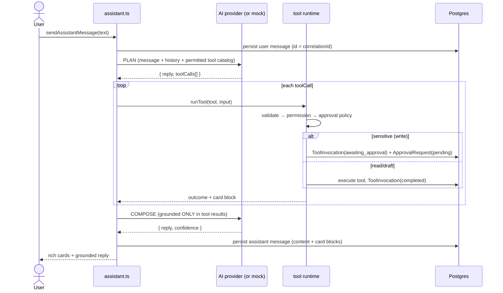

# Chat cockpit — architecture

Operanto's chat cockpit is a **conversational operations layer over structured
records, controlled workflows, and real tools** — not a chatbot. The model
*proposes*; the runtime *decides and executes*; humans *approve* sensitive acts.

> Chat for interaction. Structured records for control. Tools for execution.

## Layers

```
UI (App Router, RSC + client islands)
  └─ /[workspace]/assistant            three-panel cockpit
  └─ /[workspace]/approvals            approval queue
  └─ /[workspace]/opportunities|properties|audit   operational screens
        │  server actions ("use server")
        ▼
Services  (src/lib/services/*, workspace-scoped, RBAC + audit)
  └─ assistant.ts        turn orchestration (plan → execute → compose)
  └─ approvals.ts        approval queue reads
        │
        ▼
Tool runtime (src/lib/tools/*)         the ONLY executor of effects
  └─ registry.ts   compose core + active vertical tools
  └─ runtime.ts    validate → permission → approval → execute → persist → audit
  └─ policy.ts     deny-by-default approval resolution
        │
        ▼
AI layer (src/lib/ai/*)                provider-agnostic, mock-by-default
  └─ planAssistantTurn / composeAssistantReply / translate  (+ existing tasks)
        │
        ▼
Prisma / PostgreSQL · channel connectors · (mock) social adapter
```

Every tenant row carries `workspaceId`; `requireWorkspace`/`getWorkspaceContext`
resolve membership and RBAC is enforced server-side in services **and** in the
tool runtime (defense in depth). No client button is an authorization.

## An assistant turn

A turn is three deterministic steps. The model can only emit **structured data**;
it never calls a tool directly.



The turn is a single async generator, `runAssistantTurn` (`src/lib/services/assistant.ts`),
that **yields events** — `user`, `block` (a tool/approval card as it completes),
`text` (reply chunks), `done`. Two consumers share it:

- **Streaming** — `POST /[workspace]/assistant/[threadId]/stream` (a route handler)
  pipes the events as newline-delimited JSON over a `ReadableStream`; the client
  (`AssistantChat`) renders cards and reply text progressively.
- **Non-streaming** — `sendAssistantMessage` drains the same generator (used by
  the launcher / command bar). One code path, no divergence.

The turn is fully persisted regardless of transport; the model's forced-tool
provider isn't token-streamed (the reply text is chunked server-side), so
streaming is provider-agnostic and works in mock mode.

### Modes

- **`internal_assistant`** — a staff chat over the whole workspace.
- **`customer_conversation`** — a thread bound to an inbox `Conversation`
  (`linkedConversationId`). The cockpit pins the customer transcript + channel,
  shows contact/opportunity/interested-property context on the right, and injects
  the conversation into the planner so tools auto-target it (`draft_customer_reply`,
  `summarize_conversation`, `send_customer_message`, `request_viewing`). Opened from
  the inbox via "Open in assistant cockpit".

Key properties:

- **Grounding.** The final reply is composed *after* tools run, from their
  results only. Property availability/price/status are never stated without a
  fresh tool result (`check_property_availability` / `get_property`).
- **Provider-agnostic + offline.** Reuses the existing `AIProvider` (forced
  single-tool structured output). Every AI task ships a deterministic `mock`, so
  the whole cockpit works with **no API key** (`isMockMode()`), including a
  keyword-driven planner.
- **Correlation.** The user message id is the turn's `correlationId`, stamped on
  every `AuditLog`, `ToolInvocation`, and `ApprovalRequest` so a turn is one
  traceable unit (see the Audit log screen).

## Persistence

| Model | Purpose |
|---|---|
| `AssistantThread` | a chat (mode `internal_assistant` or `customer_conversation`) |
| `AssistantMessage` | user/assistant/system messages; `structuredContent` holds card blocks |
| `ToolInvocation` | one proposed/executed tool call, with status + idempotency key |
| `ApprovalRequest` | human decision on a sensitive invocation |
| `MessageDraft` | prepared (never auto-sent) customer replies / invitations |
| `Opportunity` | generic CRM lead/deal (+ extracted `requirements` JSON) |
| `ConversationContextLink` | links a conversation to any record (property, opp…) |
| `Property` | **real-estate vertical only** — source of truth for availability |

All are workspace-scoped and additive (no existing model changed destructively).

## Vertical extension

The core never imports `Property`. A `VerticalAdapter`
(`src/lib/verticals/types.ts`) contributes tools + grounding context, resolved
from `Workspace.vertical`. See [pronatona-real-estate-vertical.md](./pronatona-real-estate-vertical.md).

## What's real vs mocked

| Capability | Status |
|---|---|
| Assistant threads, plan→execute→compose, cards | **Fully working** (mock or live model) |
| Tool runtime, permissions, approvals, idempotency, audit | **Fully working**, unit-tested |
| Property/opportunity/contact/conversation search & drafts | **Fully working** against Postgres |
| Customer conversations in the cockpit | **Working** — a `customer_conversation` thread mirrors an inbox conversation (transcript + channel + structured context), reusing the same runtime/cards/approvals |
| Customer message send | **Working** for web-chat/manual via `DirectConnector`; Instagram/WhatsApp/etc. are **stubs** that fail loudly |
| Social publishing | **Mock adapter** only (`src/verticals/real-estate/social-adapter.ts`); no real IG/TikTok |
| Streaming responses | **Working** — turns stream over an NDJSON route; the non-streaming action drains the same generator |
