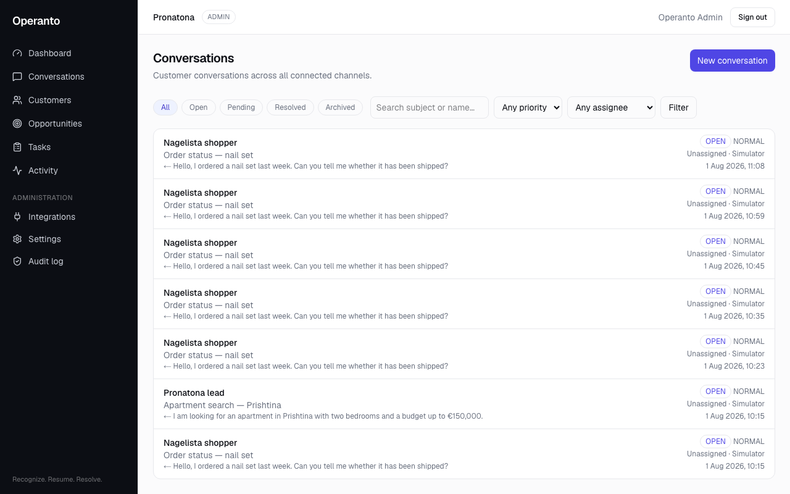
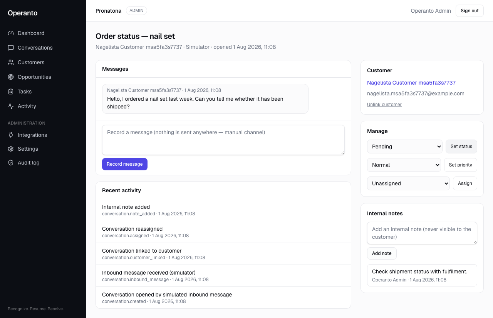

# Operanto Conversations — foundation (Slice 1)

First runtime slice of the consolidation plan (see
`docs/operanto-target-architecture.md`, backlog in
`docs/operanto-capability-gap-analysis.md` §7). Delivers organisation-scoped
conversations with manual entry and a deterministic simulator channel, fully
integrated into the existing tenancy, RBAC, audit, and privacy architecture.
No live provider channels, no AI, no workflow engine, no Growth functionality.

## Data model (migration `20260801080123_conversations_foundation`, additive)

| Model | Purpose | Notes |
|---|---|---|
| `ChannelConnection` | Per-organisation channel endpoint | Types `MANUAL` and `SIMULATOR` only; **no credential columns** — live channels add encrypted credentials in their own slice. Unique `(organisationId, type, displayName)`. |
| `Conversation` | One customer conversation | `status` (OPEN/PENDING/RESOLVED/ARCHIVED), `priority` (LOW/NORMAL/HIGH/URGENT), `assignedMembershipId` + `createdByMembershipId` (Memberships, never Users), optional `customerId`, `providerThreadId` unique per `(organisationId, channelConnectionId)` — simulator re-runs are idempotent. |
| `ConversationParticipant` | Who is in the conversation | The CUSTOMER-side row carries `displayName`/`externalRef` for counterparts not (yet) linked to a `Customer`; STAFF rows appear when a member first records a message. Never duplicates the Customer model. |
| `Message` | One inbound/outbound message | Dedupe by unique `(organisationId, channelConnectionId, providerMessageId)` — a constraint, not read-then-write. `deliveryStatus` enum is the delivery-lifecycle foundation; Slice 1 only ever writes `RECORDED` (nothing is transmitted). `redactedAt` marks retention/erasure redaction. |
| `ConversationNote` | Internal staff commentary | Deliberately a separate model from `Message`, so a future outbound adapter cannot leak a note to a customer via a mishandled direction flag. |

Also additive: `Activity.conversationId` (conversation events join the one
existing timeline — no new event table) and
`Organisation.messageRetentionDays` (per-tenant retention override).

## Routes

- `/conversations` — list: status chips, priority/assignee filters, search,
  cursor pagination (50/page), counterpart + preview + status/priority/
  assignee/channel/last-message columns.
- `/conversations/new` — manual creation: optional customer link, counterpart
  name, subject, priority, assignment, optional first message.
- `/conversations/[id]` — detail: message thread with delivery-status label,
  manual-message composer, internal notes, status/priority/assignment
  controls, customer link/unlink, restriction and erasure banners, recent
  activity. Cross-tenant ids 404.

Navigation: one "Conversations" sidebar entry. No Intelligence/Growth
placeholders. `/conversations` added to the robots disallow list.

## Permissions (existing 3-role matrix, no new roles)

| Permission | ADMIN | SUPERVISOR | OPERATOR |
|---|---|---|---|
| `conversations:view_all` | ✓ | ✓ | — |
| `conversations:view_assigned` | ✓ | ✓ | ✓ (assigned or created only) |
| `conversations:create` | ✓ | ✓ | ✓ |
| `conversations:update` (status/priority) | ✓ | ✓ | ✓ |
| `conversations:archive` | ✓ | ✓ | — |
| `conversations:assign` | ✓ | ✓ | — |
| `conversations:link_customer` | ✓ | ✓ | — |
| `conversations:note` | ✓ | ✓ | ✓ |
| `conversations:message` | ✓ | ✓ | ✓ |

Record-level access composes into every query
(`conversationAccessWhere`): operators see only conversations they are
assigned or created. Assignment validates the target is an ACTIVE membership
of the same organisation; customer links validate organisation ownership and
refuse erased tombstones.

## Service operations (`src/lib/services/conversations.ts`, `conversation-simulator.ts`)

`listConversations` · `getConversation` · `createManualConversation` ·
`addManualMessage` · `addConversationNote` · `assignConversation` ·
`changeConversationStatus` (conditional-claim update — concurrent changes
lose loudly, never silently) · `changeConversationPriority` ·
`linkConversationCustomer` · `unlinkConversationCustomer` ·
`listLinkableCustomers` · `ingestSimulatedMessage`.

Every operation takes the canonical `OrgContext`, checks the matrix, scopes
by organisation, uses transactions for multi-row writes, and emits Activity +
AuditEvent rows.

## Audit and Activity events

`conversation.created` · `conversation.inbound_received` (simulator, SYSTEM
actor) · `conversation.message_added` · `conversation.note_added` ·
`conversation.assigned` · `conversation.status_changed` ·
`conversation.priority_changed` · `conversation.archived` ·
`conversation.customer_linked` · `conversation.customer_unlinked`.

Audit metadata is PII-minimised by construction: ids and state transitions
only — **never message bodies, note bodies, subjects, or names** — so audit
longevity never conflicts with retention or erasure.

## Deterministic simulator (dev/test/staging only)

`ingestSimulatedMessage(organisationId, scenario, { runId? })` stands in for
a live channel adapter using the same shapes a real adapter will use
(connection → thread → message, constraint-based dedupe). Refuses to run with
`NODE_ENV=production` unless `OPERANTO_SIMULATOR_ENABLED=1`. No randomness —
fixed thread/message ids (an optional `runId` derives a new deterministic
thread for test harnesses). Customer linking is exact-e-mail only, never
matches erased tombstones, and never creates customers implicitly.

Scenarios: `nagelista` (order-status question) and `pronatona` (apartment
enquiry). CLI:

```sh
NODE_OPTIONS="--require ./scripts/preload.cjs" \
  pnpm simulate:conversation --scenario nagelista [--org <slug>] [--run <id>]
```

## Privacy lifecycle

- **Erasure** (`eraseCustomer`) now also redacts, for the erased customer's
  conversations: subjects, ALL message bodies (staff replies quote the
  person), note bodies, participant display identities, and conversation
  activities. Counts are audited (`conversationsRedacted`,
  `messagesRedacted`); erased customers can never be re-linked or re-matched.
- **Restriction** (Art. 18): recording new messages is blocked with a clear
  error; the state is bannered on the detail page and badged in the list.
- **Retention**: `redactExpiredMessages()` runs on the existing 5-minute cron
  alongside the payload sweep. Window = `Organisation.messageRetentionDays`
  → `OPERANTO_MESSAGE_RETENTION_DAYS` → **365 days**. The 12-month default is
  PROVISIONAL — the production policy requires contractual and legal
  confirmation before activation. Restriction and erasure always take
  precedence (erasure redacts immediately, regardless of age).

## Known limitations / deferred (by design, per the approved plan)

- **No attachments** — deliberately not modelled yet; nothing is silently
  stringified. `MessageAttachment` (with blob storage and erasure semantics)
  arrives with the channel-adapter slice.
- **No unread state, no realtime** — list/detail refresh via server actions.
- **No `CustomerIdentity` ladder rung** — channel-handle identity resolution
  is Slice 2; the simulator links by exact e-mail only.
- **No outbound transmission of any kind** — `addManualMessage` records; the
  `deliveryStatus` values beyond `RECORDED` are the contract for Slice 5.
- **No AI, no takeover, no approvals, no workflow engine, no Growth.**
- `ConversationParticipant` supports 1:1 conversations; group/CC semantics
  wait for a channel that needs them.

## Tests

- Unit (`pnpm test`): RBAC matrix additions, access-where shapes, validation
  and permission gates that reject before any DB access, retention-window
  resolution.
- Integration (`pnpm test:integration`, real PostgreSQL via
  `TEST_DATABASE_URL`): manage cycle with audit trail, cross-tenant
  list/read/write/assign/link denial, operator record-level scoping,
  simulator determinism + idempotency + erased-tombstone behaviour, erasure
  across all new models, per-organisation retention, unlink never smearing
  names.
- E2E (`pnpm test:e2e`): Nagelista and Pronatona flows — simulator ingestion
  → list → detail → link → assign → note → status/priority → activity
  timeline → audit log.

## Screenshots





## Migration and rollback

`20260801080123_conversations_foundation` is purely additive (new enums, five
new tables, two nullable columns, tenancy-scoped uniques). It replays on a
clean database (CI job + local verification) and applies to the current
production schema without touching existing rows. Reversal, if ever needed,
is dropping the new tables/columns — no existing table is modified
destructively, so no backfill or data-restore plan is required.
