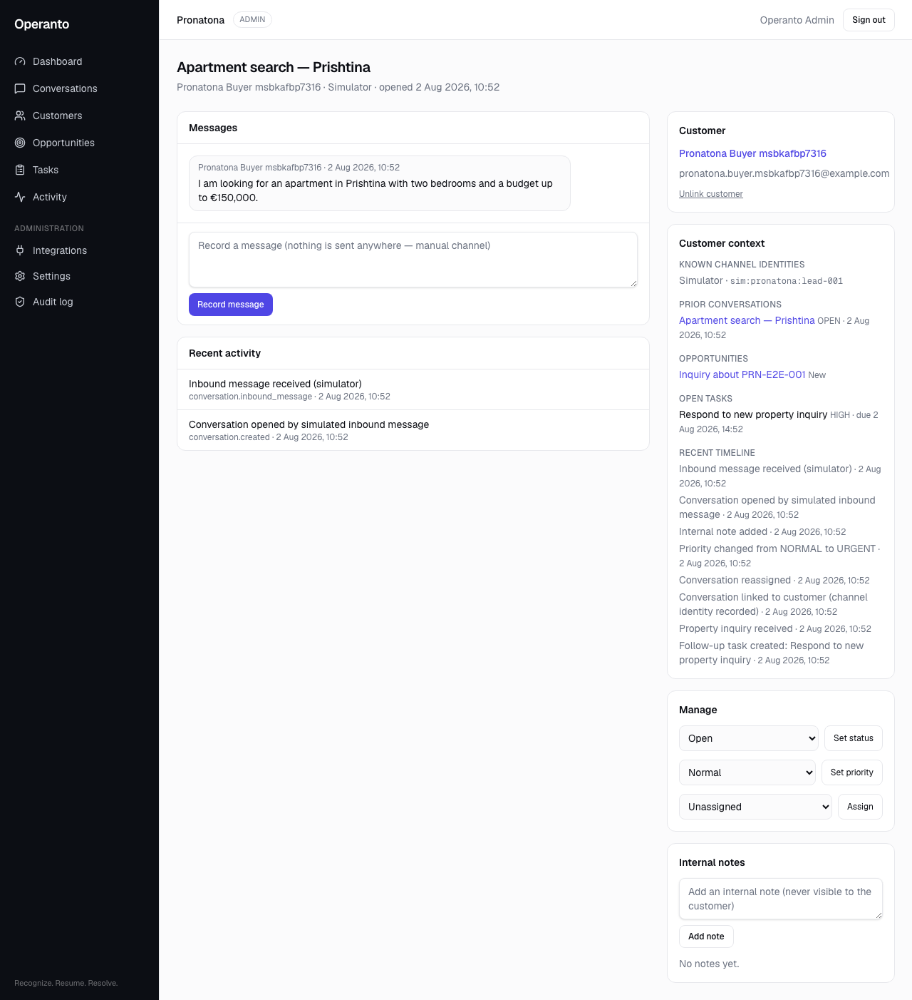

# Operanto customer context (Slice 2)

Second runtime slice of the consolidation plan: channel identity resolution
and the customer-context panel, so a returning customer never has to
reintroduce themselves. Builds directly on the conversations foundation
(`docs/operanto-conversations-foundation.md`).

## CustomerIdentity (migration `20260802084506_customer_identity`, additive)

One row per `(organisation, channelType, externalId)` — the exact-match rung
that lets channel ingestion recognise a returning sender. Same philosophy as
the events identity ladder (`docs/customer-matching.md`): exact keys only,
never fuzzy, erased tombstones never re-matched, a wrong link worse than a
missed one.

**Identities are taught, not inferred.** The only writer is
`linkConversationCustomer`: when staff link a conversation whose counterpart
carries a channel reference, that explicit, audited decision records the
identity (`source: "manual_link"`). Unlinking withdraws the claim — otherwise
the next inbound message would silently re-link. Erasure **deletes** identity
rows (they are pure identifiers; audited as `channelIdentitiesDeleted`).

Channel ingestion resolution order (simulator today, live adapters later):

```text
1. CustomerIdentity (channelType, externalId)   — taught, exact
2. e-mail exact match                            — scenario/channel-provided
3. no match → unlinked conversation              — never creates customers
```

## Customer-context panel

`getCustomerContext` (`src/lib/services/customer-context.ts`) assembles, for
the linked customer: known channel identities, prior conversations, open
opportunities, open tasks, and the recent timeline. Rendered on the
conversation detail page beneath the customer card.

Scoping: every section is filtered by the CALLER's record-level access —
operators see the customer's prior conversations/opportunities/tasks only to
the extent they could open each directly (`conversationAccessWhere`,
`opportunityAccessWhere`, `taskAccessWhere`), and the org-wide timeline
additionally requires `activity:view_all`. Cross-tenant customer ids return
null. No new permissions were added.

## Tests

- Integration: teach-on-link → auto-link on the next message; identity
  outranks e-mail; unlink withdraws the claim; tenant isolation of
  identities; erasure deletes identities and never re-links the tombstone;
  context assembly scoped per role; cross-tenant context denial.
- E2E (Pronatona flow): manual link → second simulated message auto-links →
  context panel shows prior conversation and known channel identities.

## Screenshot



## Deferred

Identity verification states (`verifiedAt`), automatic identity suggestions,
merge-review tooling, and live-channel identity capture (arrives with the
channel-adapter slice, which will feed provider sender ids through the same
`resolveCustomerByChannelIdentity` rung).
