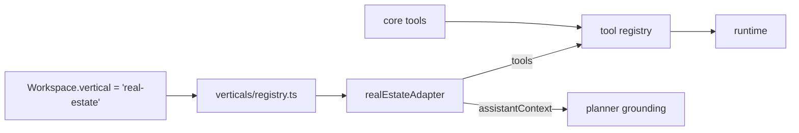

# Pronatona — real-estate vertical

Pronatona (Kosovo real estate) is the first real deployment and the reference
**vertical**. Real-estate concepts live entirely in `src/verticals/real-estate/`;
the generic Operanto core never imports `Property`.

## Extension mechanism



- `VerticalAdapter` (`src/lib/verticals/types.ts`) contributes `tools`,
  `assistantContext` (grounding rules), and `cardKinds`.
- `getVertical(workspace.vertical)` (`src/lib/verticals/registry.ts`) is the
  single composition root that names a concrete vertical.
- The tool registry merges `coreTools` + `adapter.tools`; the assistant injects
  `assistantContext` into the planner/composer system prompts.

The core stays vertical-agnostic: `Opportunity` is generic CRM with a
`requirements` JSON and a generic `linkedRecordType`/`linkedRecordId` pointer, so
a lead can reference a `property` without the core knowing what a property is.

## Data (real-estate only)

`Property` is the **source of truth** for code, price, area, location, media,
availability, assigned agent, and publication status:

```
code (PR-1042) · title · type · listingType · status
price/currency · areaSqm · bedrooms · bathrooms · city/district
media[] · features[] · assignedAgent · publicationStatus · availabilityNote
status ∈ available | reserved | under_offer | sold | off_market
```

## Tools

`search_properties`, `get_property`, **`check_property_availability`**,
`find_matching_properties`, `get_agent_availability`, `draft_social_post`,
`queue_social_post`, `request_viewing`, `schedule_viewing` — see
[ai-tool-execution.md](./ai-tool-execution.md) for risk/permission/approval.

## Grounding rule (no invented facts)

The adapter's `assistantContext` instructs the model to never claim a property is
available (or state price/legal status) without a fresh
`check_property_availability` / `get_property` result. `check_property_availability`
returns `available = (status === "available")`, so a **reserved** or **sold**
property is reported as not available and the assistant offers
`find_matching_properties` alternatives instead.

Example (Journey 4): a customer asks about `PR-1033` (reserved) → availability
tool returns `reserved` → the assistant does **not** claim availability →
suggests available matches.

## Cards

Renderers in `src/components/cockpit/cards.tsx`: `property.list`,
`property.detail`, `property.availability` (green/red, authoritative),
`social.draft`, `social.queued`, `viewing.request`, `viewing.scheduled`,
`agent.availability`. Screen: `/[workspace]/properties` (catalogue, real-estate
only).

## Connectors — honest status

- **Property catalogue** — real, in Postgres (the source of truth).
- **Social publishing** — `src/verticals/real-estate/social-adapter.ts` is a
  **mock** publisher. It records a queued job (real `ContentDraft` state + audit)
  but nothing reaches Instagram/TikTok. A live adapter is gated behind
  `OPERANTO_SOCIAL_LIVE=1` and intentionally errors ("not configured") because no
  channel credentials exist. No fake platform integration is presented as real.
- **Customer messaging** — Instagram/WhatsApp send is a `ProviderStub` that fails
  loudly until credentials + signature verification are wired; web-chat/manual
  deliver in-app via `DirectConnector`.

## Adding another vertical

1. Create `src/verticals/<id>/` with `tools.ts` and an adapter exporting a
   `VerticalAdapter`.
2. Register it in `src/lib/verticals/registry.ts`.
3. Add card renderers for its `card` keys in `cards.tsx`.
4. Set `Workspace.vertical = "<id>"` (seed or DB).

No change to the core runtime, approvals, CRM, or assistant is required.
